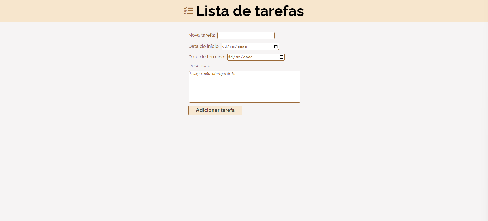
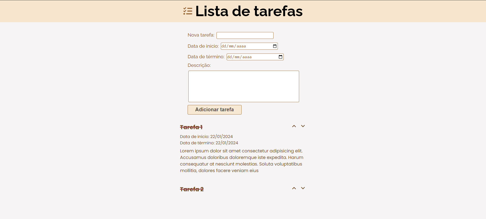
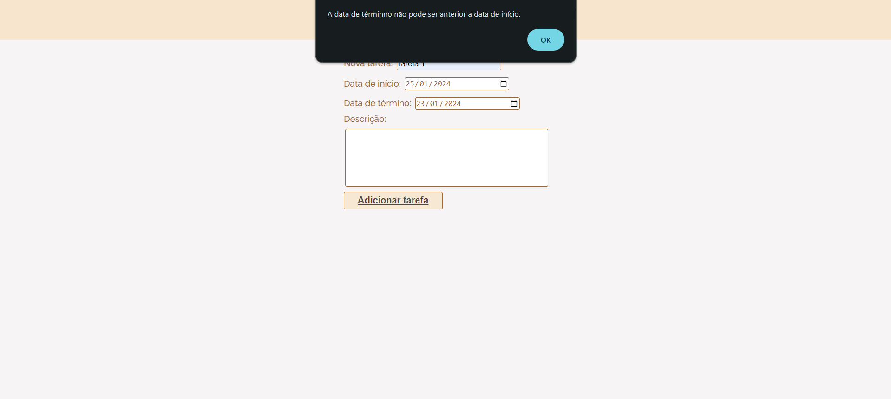

# To-Do List


This application demonstrates the use of jQuery to dynamically display information on the screen as the user interacts with it and to control inputs. It functions as a to-do list where the user can input a new task along with its start and end dates (description is optional). The user can utilize expand arrows to view or hide the task details. Once a task is completed, the user can click on it to cross it off the list.


## Index
- <a href="#functionalities">Application functionalities</a>
- <a href="#layout">Layout</a>
- <a href="#demonstration">Demonstration</a>
- <a href="#run">How to run the application</a>
- <a href="#tecnologies-used">Tecnologies used</a>
- <a href="#developer">Developer</a>

## Application functionalities
 - [x]  Enter the new task
 - [x]  View or hide the tasks details
 - [x]  Cross off a task when it's done

## Layout






## Demonstration
[Link (deploy)](https://to-do-list-theta-five.vercel.app/)


## How to run the application
```bash
# Clone this repository
$ git clone repolink

# Acess the app folder on your terminal
$ cd to-do-list

# Utilize a local server launch tool to view the application in your browser

```

## Tecnologies used
1. HTML
2. CSS
3. DOM
4. Javascript
5.jQuery

## Developer
[LinkedIn](https://www.linkedin.com/in/julia-silva-borges/)
